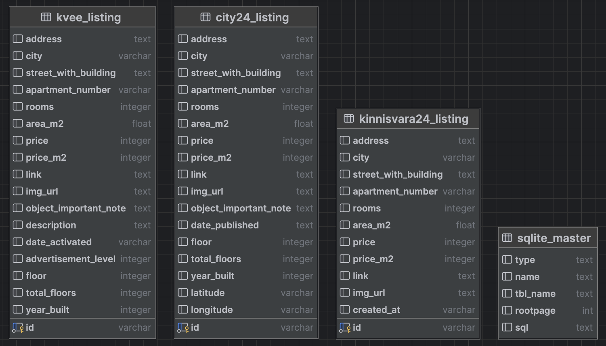
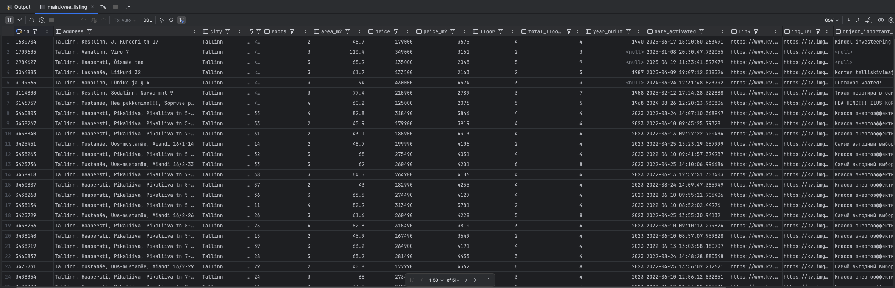
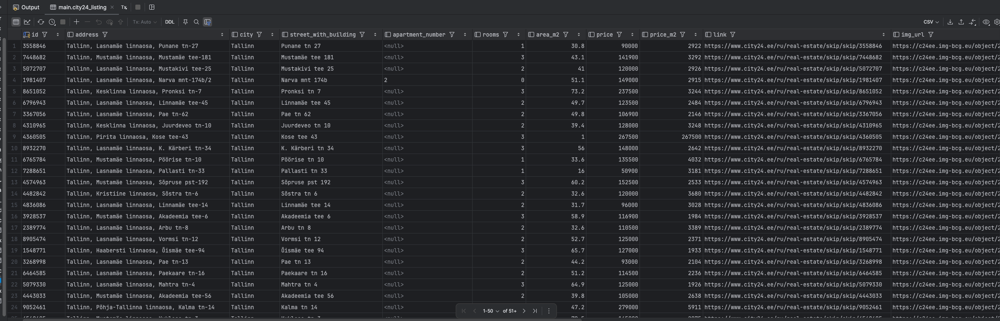
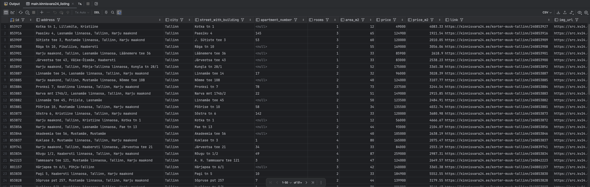

# Parse apartment prices in Tallinn from kv.ee, city24.ee, kinnisvara24.ee

Application is parsing and storing real estate prices from main Estonian real estate portals:

- [kv.ee](https://www.kv.ee)
- [city24.ee](https://www.city24.ee)
- [kinnisvara24.ee](https://kinnisvara24.ee)

## Project goal

The goal is to validate and find apartments which are posted not all portals. For example, apartment has listing on city24.ee, but not on kv.ee.

The motivation behind this experiment is to check if there are some mispriced apartments (possibly, by apartment owners, or maklers that try to save on advertising) which are posted only on 1 portal.   

## Features

- Stores the results for each portal in separate tables in DB.

## Usage

```
python real_estate_parser_cli.py --portal [PORTAL_TYPE]
```

Example:

```
python real_estate_parser_cli.py --portal kvee
python real_estate_parser_cli.py --portal city24
python real_estate_parser_cli.py --portal kinnisvara24
```

## Testing

Run tests using one of the following commands:

```bash
# Run all tests
python -m pytest tests/ -v

# Run specific test file
python -m pytest tests/parsers/test_city24_parser.py -v

# Run tests using the test runner script
python run_tests.py
```


# Data

## DB model



## Data example

### Kv.ee
[All kv.ee listings (as of 2025/06/23).csv](documentation/data/csv/all_kvee_listings.csv)


### City24.ee
[All city24.ee listings (as of 2025/06/23).csv](documentation/data/csv/all_city24_listings.csv)


### Kinnisvara24.ee
[All kinnisvara24.ee listings (as of 2025/06/23).csv](documentation/data/csv/all_kinnisvara24_listings.csv)


# Data validation (for Tallinn apartment prices only)

## 1. Query total number of listings
```
select 'kvee', count(1) as portal from kvee_listing
union all
select 'city24', count(1) as portal from city24_listing
union all
select 'kinnisvara24', count(1) as portal from kinnisvara24_listing;
```

**Result**:
```
kvee, 4766
city24, 4242
kinnisvara24, 3221
```

## 2. Query to validate if apartment ad is posted only on single portal

### 2.1. Find listings on "kinnisvara24.ee" which are not present on "kv.ee"
```
select *
from kinnisvara24_listing k24
where not exists(
    select 1
    from kvee_listing kvee
    where 1=1
      and k24.city = kvee.city
      and REPLACE(REPLACE(kvee.street_with_building, ' tn', ''), ' mnt', '') =
          REPLACE(REPLACE(k24.street_with_building, ' tn', ''), ' mnt', '')
);
```
NB: we don't join data by "apartment number" because on some portals apartment number's present, on some portals it's not. We simplified the validation request to check only by city, street, and building number.

**Result**: 328 listings.  
[Results.csv](documentation/data/csv/find_listings_present_on_kinnisvara24_and_missing_on_kvee.csv) (as of 2025/06/23)

### 2.2. Find listings on "city24.ee" which are not present on "kv.ee"
```
select city24.*,
       CONCAT('https://www.google.com/maps/dir//', latitude, ',', longitude, '/@', latitude, ',', longitude, ',15z/data=!4m2!4m1!3e0?entry=ttu') AS map_link
from city24_listing city24
where not exists(
    select 1
    from kvee_listing kv
    where 1=1
      and city24.city = kv.city
      and
        REPLACE(REPLACE(kv.street_with_building, ' tn', ''), ' mnt', '') =
        REPLACE(REPLACE(city24.street_with_building, ' tn', ''), ' mnt', '')
--       and (
--         (city24.apartment_number is null and kv.apartment_number is null)
--             or (city24.apartment_number is not null and city24.apartment_number = kv.apartment_number)
--       )
);
```
**Result**: 434 listings.  
[Results.csv](documentation/data/csv/find_listings_present_on_city24_and_missing_on_kvee.csv) (as of 2025/06/23)


# Summary
We detected listings which are present only on one portal that are not present on another portal:
- 328 (out from 4242) apartments are listed on [city24.ee](https://www.city24.ee) which are not present on [kv.ee](https://www.kv.ee). [Results.csv](documentation/data/csv/find_listings_present_on_kinnisvara24_and_missing_on_kvee.csv)
- 434 (out from 3221) apartments are listed on [kinnisvara24.ee](https://kinnisvara24.ee) which are not present on [kv.ee](https://www.kv.ee).

However, we couldn't find mispriced opportunities which we were expected to find in such listings, these listings are more-less align with market value.
